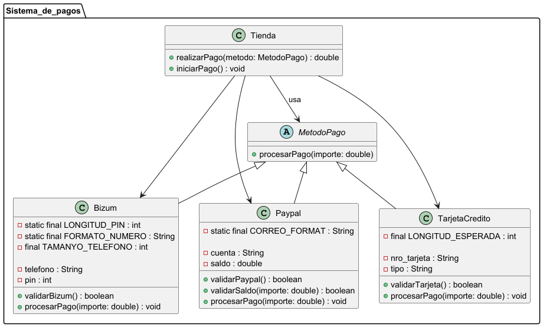

# Práctica 1. Práctica de compra-venta de casas

## ÍNDICE
1. [Intro](#1-intro)
2. [Estructura de clases](#2-estructura-de-clases)
   - Diagrama de clases UML
   - Código de PlantUML
   - Contenido de las clases (.java)
4. [Programa principal](#3-programa-principal)
5. [Pruebas](#4-pruebas)
6. [Entrega](#5-entrega)

### 1. Intro
> La práctica consiste en una app de un sistema de pagos para tu tienda de cursos online. La tienda acepta
diferentes métodos de pago, como tarjeta de crédito, PayPal o Bizum. Cada método de pago tiene una
forma distinta de procesar el pago, pero todos comparten la misma funcionalidad básica para hacerlo: un
método llamado procesarPago().

### 2. Estructura de clases

#### Diagrama de clases UML


#### Código de PlantUML


````
@startuml
package "Sistema_de_pagos" {

    '-------------------------
    ' Clase abstracta MetodoPago
    '-------------------------
    abstract class MetodoPago {
        + procesarPago(importe: double)
    }

    '-------------------------
    ' Clase Bizum
    '-------------------------
    class Bizum {
        - static final LONGITUD_PIN : int
        - static final FORMATO_NUMERO : String
        - final TAMANYO_TELEFONO : int

        - telefono : String
        - pin : int

        + validarBizum() : boolean
        + procesarPago(importe: double) : void
    }

    '-------------------------
    ' Clase Paypal
    '-------------------------
    class Paypal {
        - static final CORREO_FORMAT : String

        - cuenta : String
        - saldo : double

        + validarPaypal() : boolean
        + validarSaldo(importe: double) : boolean
        + procesarPago(importe: double) : void
    }

    '-------------------------
    ' Clase TarjetaCredito
    '-------------------------
    class TarjetaCredito {
        - final LONGITUD_ESPERADA : int

        - nro_tarjeta : String
        - tipo : String

        + validarTarjeta() : boolean
        + procesarPago(importe: double) : void
    }

    '-------------------------
    ' Clase Tienda
    '-------------------------
    class Tienda {
        + realizarPago(metodo: MetodoPago) : double
        + iniciarPago() : void
    }

    '-------------------------
    ' Relaciones
    '-------------------------
    MetodoPago <|-- Bizum
    MetodoPago <|-- Paypal
    MetodoPago <|-- TarjetaCredito

    Tienda --> MetodoPago : usa
    Tienda --> Bizum
    Tienda --> Paypal
    Tienda --> TarjetaCredito
}
@enduml

````

#### Contenido de las clases (.java)

- Clase abstracta **Metodo pago**:

````
package Sistema_de_pagos;

/**
 * Clase madre abstracta que depende cada uno de sus hijos con el metodo de pago que tenga
 */

public abstract class MetodoPago {

    public abstract void procesarPago(double importe);
}

````

[Link acceso a GitHub](https://github.com/angelrocaaa/POO_DAM/blob/main/POO_1dam/src/main/java/Sistema_de_pagos/MetodoPago.java)

- Clase **Bizum**:

````
package Sistema_de_pagos;

import java.util.Random;
import java.util.Scanner;

/**
 * @author dam1
 * @version 1.0
 */

public class Bizum extends MetodoPago {

    static Scanner teclado = new Scanner(System.in);
    static Random aleatorio = new Random();

    private static final int LONGITUD_PIN = 6;
    private static final String FORMATO_NUMERO = "[0-9][0-9][0-9][0-9][0-9][0-9][0-9][0-9][0-9]";
    private final int TAMANYO_TELEFONO = 9;

    private String telefono;
    private int pin;

    public Bizum (String telefono) {
        this.telefono = telefono;
        pin = setPin();
    }

    public String getTelefono() {
        return telefono;
    }

    public void setTelefono(String telefono) {
        this.telefono = telefono;
    }

    public int getPin() {
        return pin;
    }

    /**
     * @author dam1
     * @version 1.0
     * Este metodo lo que hace es generar un pin de manera aleatorio con numeros del 0 al 9 con una longitud de 6 caracteres.
     * @return un int que antes era un String pero con el parseInt lo pasamos a int
     */

    public int setPin() {

        String generarPin = "";
        for (int i = 0; i < LONGITUD_PIN; i++) {
            generarPin += aleatorio.nextInt(0,10);
        }

        System.out.println(generarPin);
        return Integer.parseInt(generarPin);
    }

    /**
     * @author dam1
     * @version 1.0
     * Este metodo lo que hace es que valida una operación de Bizum comprobando que el teléfono tenga la longitud correcta y que el PIN introducido coincida con el que ya tenemos.
     * @return boolean true si todas las validaciones son correctas false si algo no se cumple
     */

    public boolean validarBizum(){
        System.out.println("Escribe el pin de Bizum");
        int pin = teclado.nextInt();
        teclado.nextLine();

        if (telefono.length() == TAMANYO_TELEFONO && pin == this.pin){
            System.out.println("Bizum válido");
            return true;
        } else if (telefono.length() != TAMANYO_TELEFONO) {
            System.out.println("La cantidad de números debería de ser " + TAMANYO_TELEFONO);
            return false;
        }else {
            System.out.println("Pin incorrecto");
            return false;
        }
    }

    @Override
    public String toString() {
        return "Bizum{" +
                "telefono='" + telefono + '\'' +
                ", pin=" + pin +
                '}';
    }

    @Override
    public void procesarPago(double importe) {
        System.out.println("Procesando pago de " + importe + " €" + " con Bizum");
    }
}


````

[Link acceso a GitHub](https://github.com/angelrocaaa/POO_DAM/blob/main/POO_1dam/src/main/java/Sistema_de_pagos/Bizum.java)

- Clase **Paypal**:

````
package Sistema_de_pagos;

public class Paypal extends MetodoPago {

    private static final String CORREO_FORMAT = "^[A-Za-z0-9+_.-]+@[A-Za-z0-9+_.-]+.com$";


    private String cuenta;
    private double saldo;

    public Paypal(String cuenta) {
        this.cuenta = cuenta;
        saldo = 23;
    }

    /**
     * @author dam1
     * @version 1.0
     * Este método comprueba el formato del correo de la cuenta de paypal con la constante del CORREO_FORMAT
     * @return true si el formato del correo es correcto false si no lo es.
     */
    public boolean validarPaypal() {
        if (cuenta.matches(CORREO_FORMAT)) {
            System.out.println("La cuenta de paypal es correcta");
            return true;
        } else {
            System.out.println("ERROR. El formato no es correcto");
            return false;
        }
    }

    /**
     * @author dam1
     * @version 1.0
     * @param importe es la cantidad para ver si el saldo es suficiente para pagar
     * @return true si el importe es menor o igual al saldo y false si el importe es mayor que el saldo.
     */
    public boolean validarSaldo(double importe){
        if (importe>saldo){
            System.out.println("No tienes suficiente saldo para pagar.");
            return false;
        }else {
            System.out.println("Saldo suficiente para pagar");
            return true;
        }
    }

    public String getCuenta() {
        return cuenta;
    }

    public void setCuenta(String cuenta) {
        this.cuenta = cuenta;
    }

    public double getSaldo() {
        return saldo;
    }

    public void setSaldo(double saldo) {
        this.saldo = saldo;
    }

    @Override
    public String toString() {
        return "Paypal{" +
                "cuenta='" + cuenta + '\'' +
                ", saldo=" + saldo +
                '}';
    }

    @Override
    public void procesarPago(double importe) {
        System.out.println("Procesando pago de " + importe + " €" + " con Paypal");
    }
}


````

[Link acceso a GitHub](https://github.com/angelrocaaa/POO_DAM/blob/main/POO_1dam/src/main/java/Sistema_de_pagos/Paypal.java)

- Clase **Tarjeta_Credito**:

````
package Sistema_de_pagos;

public class TarjetaCredito extends MetodoPago{

    private final int LONGITUD_ESPERADA = 16;

    private String nro_tarjeta;
    private String tipo;

    public TarjetaCredito(String nro_tarjeta, String tipo) {
        this.nro_tarjeta = nro_tarjeta;
        this.tipo = tipo.toUpperCase();
    }

    public String getNro_tarjeta() {
        return nro_tarjeta;
    }

    public void setNro_tarjeta(String nro_tarjeta) {
        this.nro_tarjeta = nro_tarjeta;
    }

    public String getTipo() {
        return tipo;
    }

    public void setTipo(String tipo) {
        this.tipo = tipo;
    }

    @Override
    public String toString() {
        return "TarjetaCredito{" +
                "nro_tarjeta='" + nro_tarjeta + '\'' +
                ", tipo='" + tipo + '\'' +
                '}';
    }


    @Override
    public void procesarPago(double importe) {
        System.out.println("Procesando pago de " + importe + " €" + " con tarjeta de crédito " + tipo);
    }

    /**
     * @author dam1
     * @version 1.0
     * Este método comprueba que la longitud de la tarjeta sea el que dice la constante y el tipo dela tarjeta sea igual a una de las que le pasamos.
     * @return true si la longitud y el tipo es valido y false si alguna de las dos validaciones no es valida
     */

    public boolean validarTarjeta() {
        if (nro_tarjeta.length() == LONGITUD_ESPERADA && tipo.equals("VISA") || tipo.equals("MASTERCARD") || tipo.equals("MAESTRO")) {
            System.out.println("La tarjeta de crédito es valida.");
            return true;
        } else {
            System.out.println("La tarjeta de crédito no es valida.");
            return false;
        }
    }
}


````

[Link acceso a GitHub](https://github.com/angelrocaaa/POO_DAM/blob/main/POO_1dam/src/main/java/Sistema_de_pagos/TarjetaCredito.java)

- Clase abstracta **Tienda**:

````
package Sistema_de_pagos;

import java.util.Scanner;

public class Tienda {

    static Scanner teclado = new Scanner(System.in);

    public static double realizarPago(MetodoPago metodo) {
        System.out.println("Introduce el importe a pagar: ");
        double importe = teclado.nextDouble();
        teclado.nextLine();

        metodo.procesarPago(importe);
        return importe;
    }

    public static void iniciarPago() {
        System.out.println("¿Qué método de pago vas a usar? [Bizum, Paypal, Tarjeta]");
        String opcion = teclado.nextLine();

        switch (opcion.toUpperCase()) {

            case "BIZUM":
                System.out.println("Escribe tu número de telefono vinculado con Bizum:");
                String telefono = teclado.nextLine();

                Bizum bizum = new Bizum(telefono);

                if (bizum.validarBizum()) {
                    realizarPago(bizum);
                    System.out.println("Pago aceptado. Muchas gracias.");
                } else {
                    System.out.println("Saliendo del programa...");
                }
                break;


            case "PAYPAL":
                System.out.println("Escribe tu cuenta de Paypal:");
                String email = teclado.nextLine();

                Paypal paypal = new Paypal(email);

                if (paypal.validarPaypal()) {

                    if (paypal.validarSaldo(realizarPago(paypal))) {
                        System.out.println("Gracias por su compra.");
                    } else {
                        System.out.println("Saliendo del programa...");
                    }

                } else {
                    System.out.println("Saliendo del programa...");
                }
                break;


            case "TARJETA":
                System.out.println("Introduce los datos de tu tarjeta:");
                String numero = teclado.nextLine();
                System.out.println("Selecciona el tipo de tarjeta [VISA, MAESTRO, MASTERCARD]:");
                String tipo_tarjeta = teclado.nextLine().toUpperCase();
                TarjetaCredito tarjeta = new TarjetaCredito(numero, tipo_tarjeta);

                if (tarjeta.validarTarjeta()) {
                    realizarPago(tarjeta);
                    System.out.println("Pago aceptado. Muchas gracias");
                } else {
                    System.out.println("Los datos de tu tarjeta no son correctos. ");
                }
                break;

            default:
                System.out.println("El método de pago no existe");

        }
    }

}

````

[Link acceso a GitHub](https://github.com/angelrocaaa/POO_DAM/blob/main/POO_1dam/src/main/java/Sistema_de_pagos/Tienda.java)

### 3. Programa principal
````
package Sistema_de_pagos;

public class AppEcommerce {
    public static void main(String[] args) {
        Tienda.iniciarPago();
    }
}

````
[Link a la clase en github](https://github.com/angelrocaaa/POO_DAM/blob/main/POO_1dam/src/main/java/Sistema_de_pagos/AppEcommerce.java)

### 4. Pruebas
- Prueba de elegir un método de pago no válido

- Prueba Tarjeta correcta

- Prueba Tarjeta incorrecta

- Prueba Bizum correcto

- Prueba Número de telefono bizum

- Prueba Bizum incorrecto

- Prueba Paypal correcto

- Prueba Paypal saldo insuficiente

- Prueba Paypal cuenta


### 5. Entrega

- [X] Código fuente en Github
- [X] Documentacion
- [X] Pruebas
